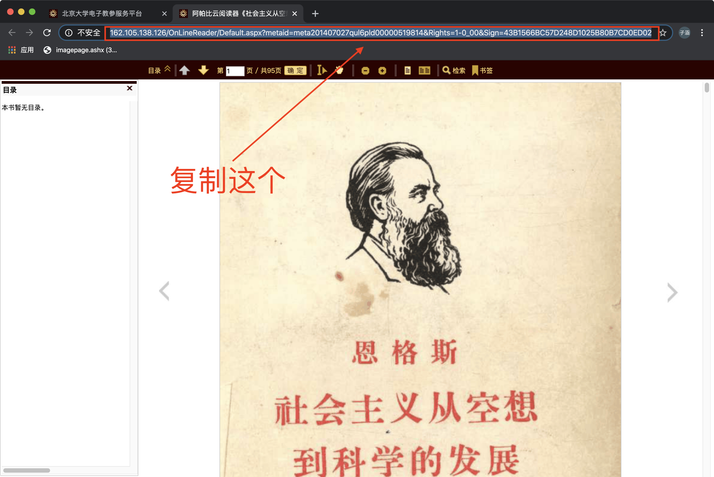
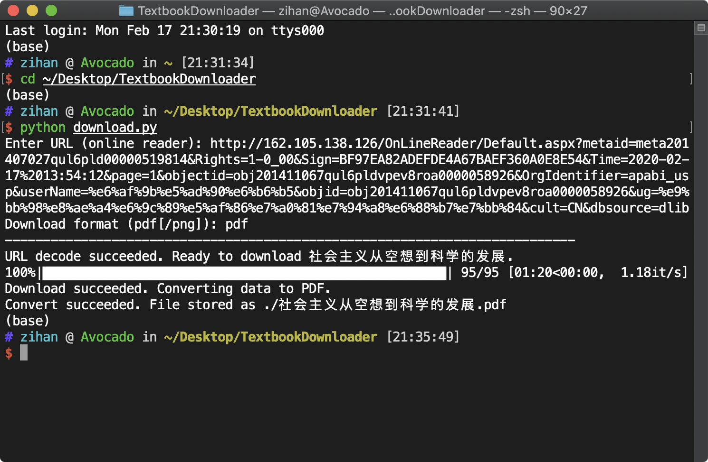

# Textbook Downloader

自己写的 [PKU电子教参平台](http://162.105.138.126/Usp/) 下载工具


## 安装

暂时没有上传到 GitHub，所以你能看到这个 readme 应该已经下载了源代码了 （骗你的）

需要 Python3 环境运行（开发环境为 Python 3.7.3）

依赖包：`requests`, `urllib`, `beautifulsoup4`, `Pillow` （可自行使用 pip 或 conda 安装）


## 使用方法

连接 PKU VPN，在浏览器内登陆 [PKU电子教参平台](http://162.105.138.126/Usp/) 找到需要的教材，此处以某教材为例


进入在线阅览模式，记录相应 URL



打开命令行并输入

```bash
cd PATH/TextbookDownloader
python download.py
```

按照提示输入阅读器界面 URL 及目标下载格式（默认为 pdf），开始下载（注意全过程中必须保持 VPN 连接）




## 配置 config.json

默认的 `config.json` 如下：

```json
{
    "target_path": "./",
    "start": 1,
    "end": null,
    "name_fmt": "{:03d}",
    "timeout": 60,
    "target_width": 600,
    "target_scale": null
}
```

说明如下：

* target_path`: 文件存放路径（若下载格式为 png 则自动创建文件夹存放）

* `start`, `end`: 起始、结束页面编号（以在线阅读器显示为准）

* `name_fmt`: 下载 png 图片时每张图片命名规则
* `timeout`: 单页下载最长等待时（单位 s）

* `target_width`: 指定下载目标的页面宽度（单位 px）
* `target_scale`: 指定下载目标页面大小相对在线阅读器中的比例（若与 `target_width` 同时指定，则会被 `target_width` 覆盖）


## 异常处理

使用 `Ctrl` + `C` 抛出 `KeyboardInterrupt` 或 `requests.get()` 抛出 `requests.exceptions.TimeOut` 后，程序将当前已经下载的内容保存，并终止运行


## 注意事项

1. 教参平台规定每次只能访问 20min，在此时间内需要完成下载，否则访问许可会失效
2. 暂时没有下载 pdf 目录的功能
3. 文件一般比较大，请耐心等待（也可以减小 `target_width` 的值压缩画质)

